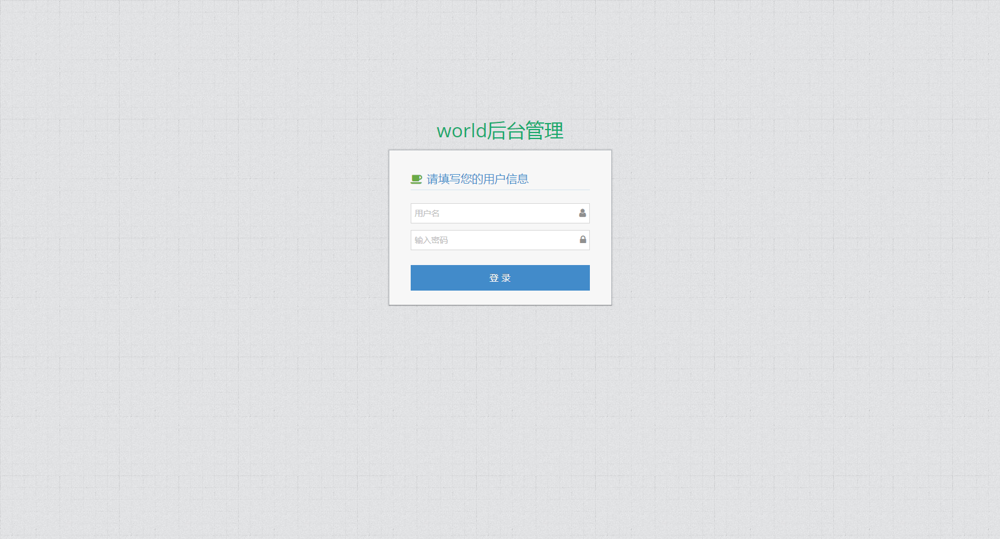
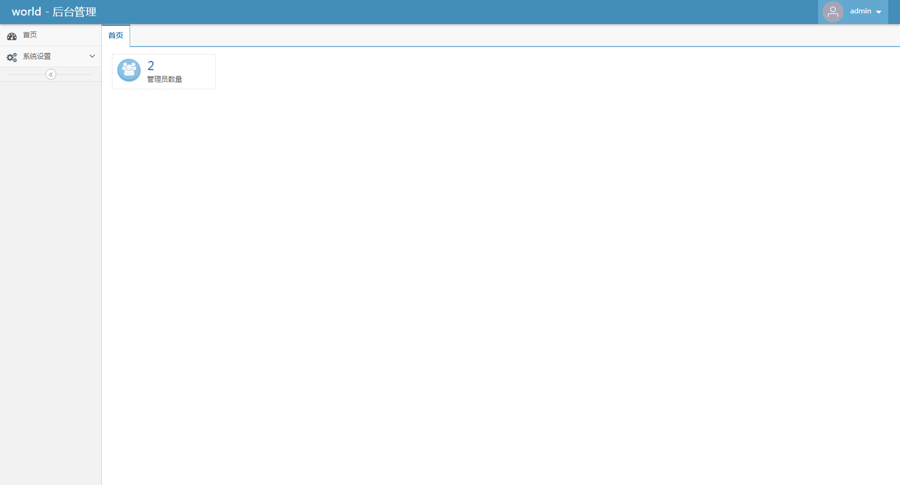
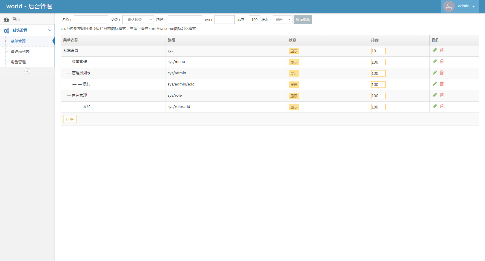

# World

基于beego框架搭建的一套通用后台管理系统，尝试使用golang做开发的朋友可以参考或在此基础上做二次开发。

## 技术栈

#### 后端框架

[beego](https://github.com/astaxie/beego)

#### 表单验证器

[go-playground/validator](https://github.com/go-playground/validator)

#### ORM库

[gorm](https://github.com/go-gorm/gorm)

#### 前端

[ace](https://github.com/bopoda/ace)

## 截图

- 登录

> 

- 首页

> 

- 菜单管理

> 

## 默认账号
用户名admin，密码123456